<h1>SMART KIDS 📚</h1>

<h2>🛠 Стек:
<h4>
  
- Typescript
- React Native
- PostgerSQL
- Redux
- Redux Saga
- Docker
- Express
- React Native Elements
- Sequelize ORM
- Node.js
- Prettier & Eslint
  
<h2>🛝 Функции:
<h4>

- Интерактивность: наше приложение предлагает взаимодействие и активное участие детей, что делает обучение более увлекательным и запоминающимся.

- Образовательное содержание: вопросы и задания разработаны с учетом образовательных стандартов и целей, чтобы помочь детям улучшить свои знания и навыки.

- Развитие навыков: "Мини викторина" способствует развитию критического мышления, логики, памяти и других важных навыков.

- Адаптивность: приложение предлагает разные уровни сложности и возможность настройки под индивидуальные потребности каждого ребенка.

<h3>💻 Команда:

- <a href="https://github.com/beeek18">Бек</a> (Lobby, Result) - TEAMLEAD

- <a href="https://github.com/igidali">Игид</a> (Questions, DB)

- <a href="https://github.com/krupeshka">Алёна</a> (Home, Profile)

- <a href="https://github.com/COBERNADOS">Чыргал</a> (Auth, Sound)

  
<b>Скриншоты</b>

   

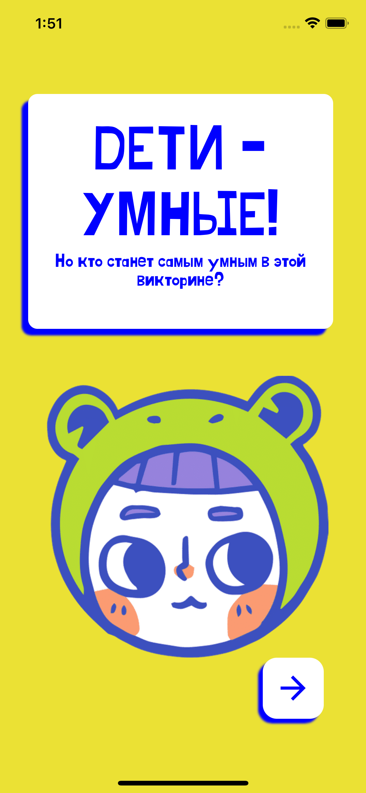
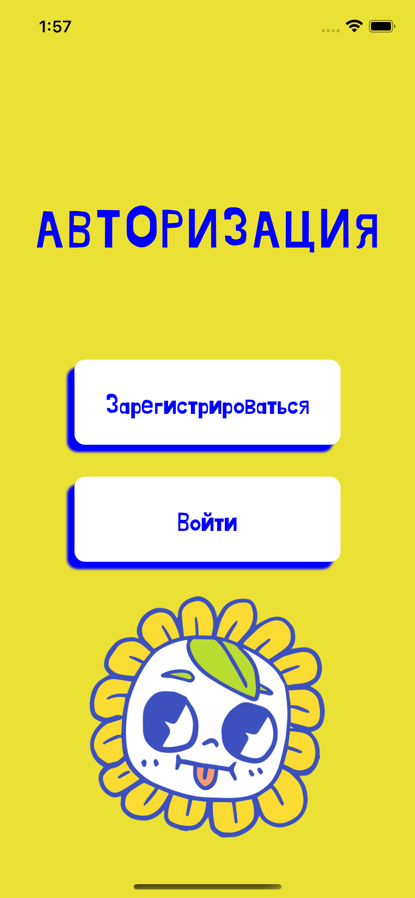
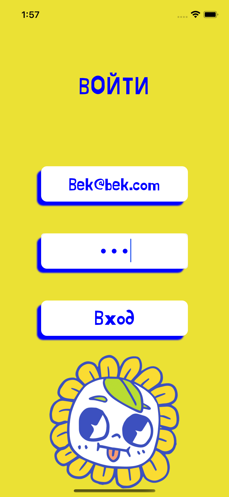
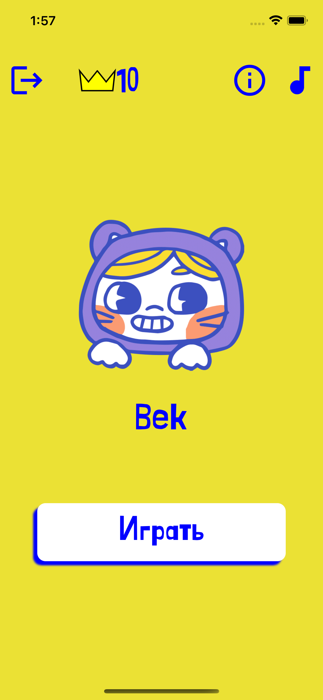
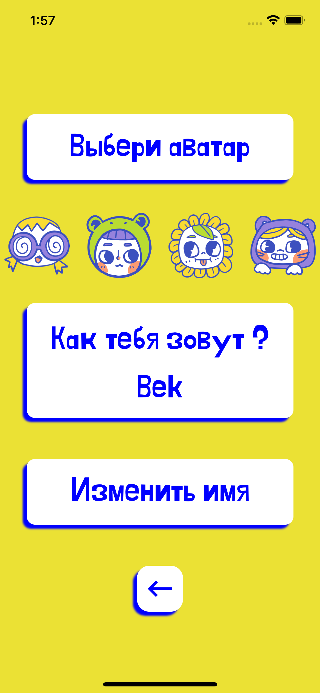
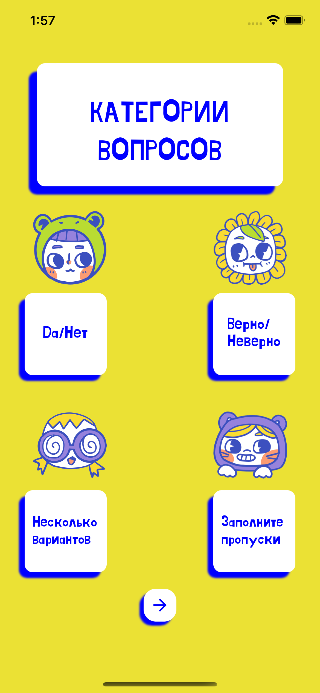

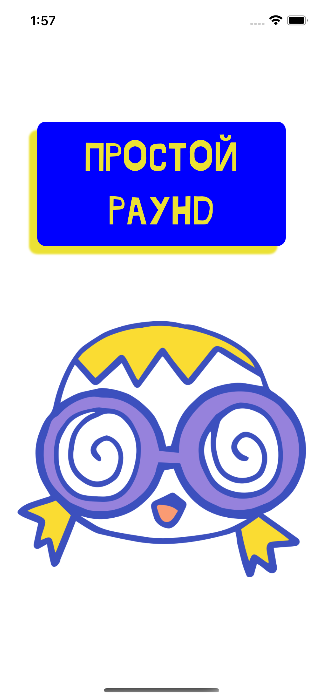
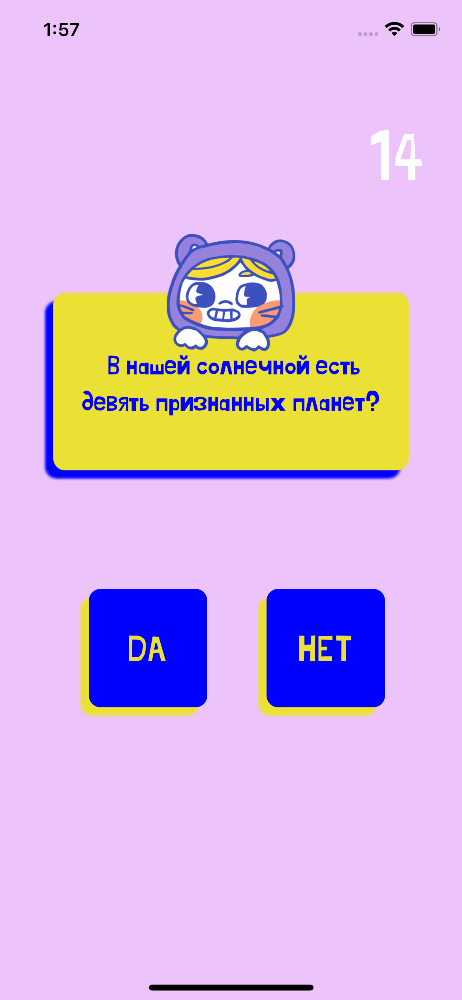
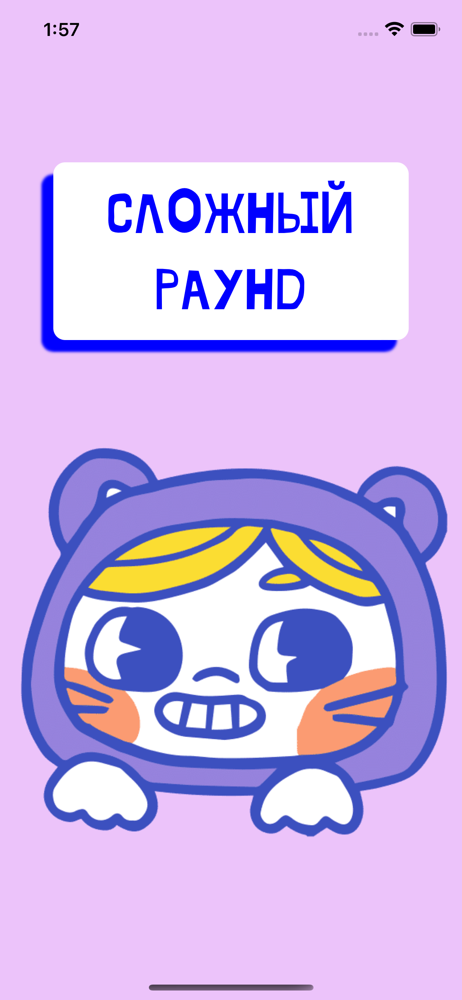
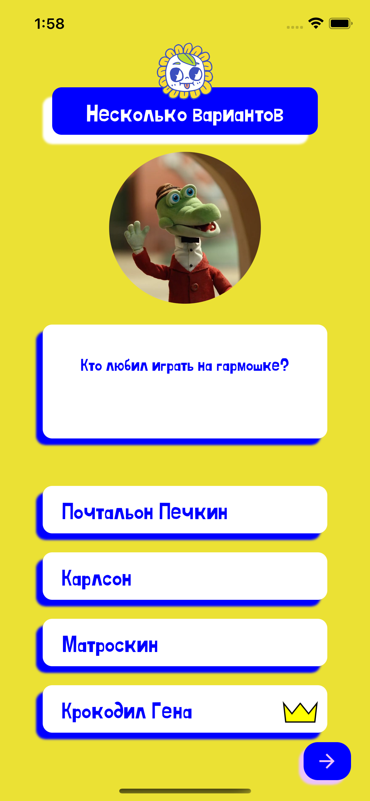
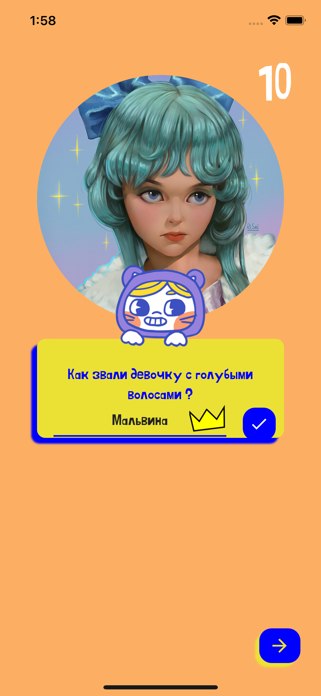
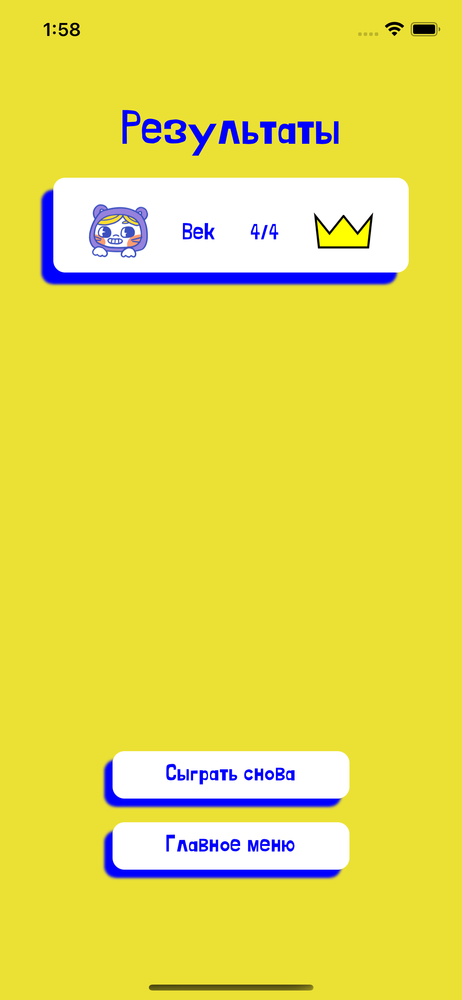

